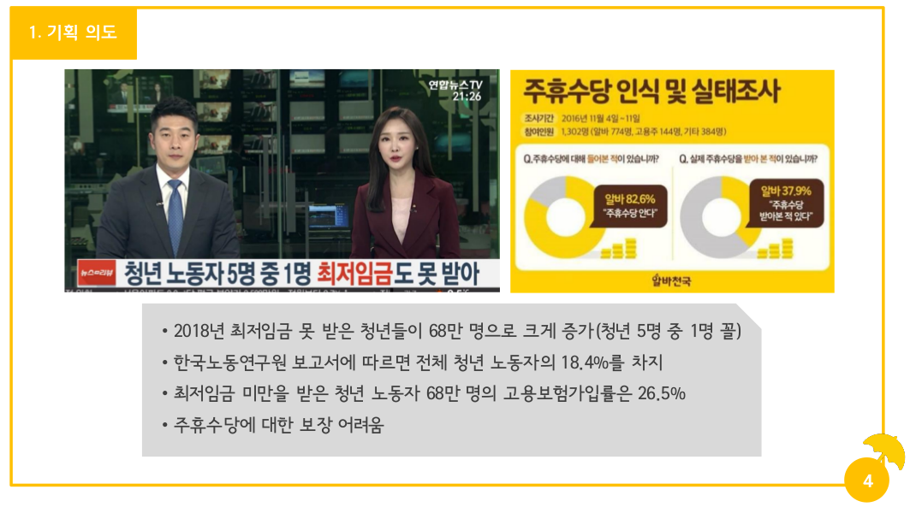
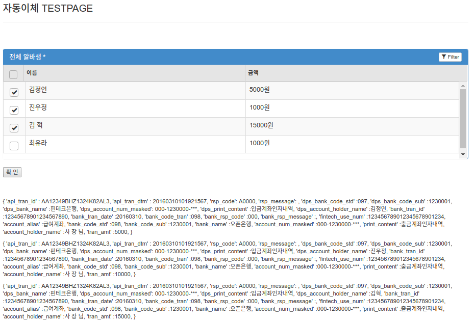

## Fintech Academy Team Project

KISA 핀테크 아카데미 개발과정 팀 프로젝트

월급 자동이체 및 직원관리 서비스 SIGBI 개발 및 최우수상 수상

<!-- more -->


<iframe width="640" height="360" src="https://youtu.be/ECDCV55sIlM" frameborder="0" gesture="media" allowfullscreen=""></iframe>


### WHAT IS SIGBI

이번 KISA 핀테크 아카데미 개발과정에서는 Open API 를 사용하여 간편 결제 및 송금 시스템을 사용한 서비스 개발을 하게 되었다.

선정된 서비스로는 '월급 자동이체 및 직원관리 서비스' 로 'SIGBI' 라는 서비스 네임을 가지고 기획과 개발에 착수하였다.


### PURPOSE

> 직원의 월급 자동지급 서비스

> 관리자의 직원 관리 통합 서비스

크게 다음과 같은 두가지 메인 기능을 가지고 시작하게 되었다.

**시장성** 조사는 사전에 진행되었고, 충분한 사업성이 보장될 수 있을 것으로 판단된다.





### FUNCTIONS

주요 기능으로는 다음과 같다

- 관리자 측면
  - 월급 자동 급여이체 서비스
  - 직원 근태관리
  - 근무기록 파일 내보내기
- 직원 측면
  - 월급 자동계산 및 자동 입금
  - 누적 시급 & 동기부여 시스템
  - 출퇴근 관리 시스템

### FLOWCHART

/image3


### EXTENSIONS

- 스마트 컨트랙트를 이용한 근로계약서 체결
- 기존 알바앱과 제휴를 맺어 상호 서비스 제공
- 사장님 및 알바생 검증 서비스


### DEVELOPMENT(Backend)

Nodejs 를 사용하여 금융결제원 OpenAPI 를 연결, 자동결제 및 은행등록 등의 절차를 서버에서 구현하였다.

다음은 Backend Dependency 를 보여준다.

```
"dependencies": {
    "async": "^2.6.0",
    "bcrypt": "^1.0.3",
    "body-parser": "^1.18.2",
    "express": "^4.16.3",
    "jsonwebtoken": "^8.2.0",
    "lodash": "^4.17.5",
    "sequelize": "^4.37.1",
}
```


프로젝트 폴더 구조는 다음과 같다.

- app (backend)
  - controller (server app controller)
  - models (database models)
  - routes (routing)
- client (frontend)
- config
  - config.js
  - db.js
  - express.js
  - jwt.js (optional)
- server.js
- package.json (npm install modules, description)


### OPEN API SIMULATION

금융결제원 테스트배드에서 입력한 내용과 동일하게 작성해준다.


*금융결제원 OPEN API 사용자 인증 및 계좌 취득 데모 코드*

```javascript
/**
 * POST: /authResult
 * 초기 토큰 발급 (성공)
 **/

module.exports.authResult = (req, res, next) => {
  let code = req.query.code;
  let option = {
    method : 'POST',
    url : 'https://testapi.open-platform.or.kr/oauth/2.0/token',
    header : 'Content-type: application/x-www-form-urlencoded; charset=UTF-8',
    form : {
      code : code,
      client_id : 'client id',
      client_secret : 'client secret key',
      redirect_uri : 'redirection uri',
      grant_type : 'authorization_code'
    }
  }
  request(option, function(err,response,body) {
    db.sequelize.query("db inserting process", function(err){})
    res.write("<script>self.close();</script>");
  });
}
```


*계좌 조회 데모 코드*

```javascript
/**
 * POST:
 * 계좌 조회 (성공)
 **/

module.exports.mydata = (req, res, next) => {
  var requestURL = 'https://testapi.open-platform.or.kr/user/me?user_seq_no=userNumber';
  option= {
    url: requestURL,
    method:'get',
    headers: {
      'Authorization': 'Bearer Token',
    }
  }
  request(option,function(error,response,body){
    console.log(JSON.parse(body).res_list);
    res.send(body);
  })
}
```


*잔액 조회 데모 코드*

```javascript
/**
 * POST:
 * 잔액 조회 (성공)
 **/

module.exports.mylist = (req, res, next) => {
  var requestURL = 'https://testapi.open-platform.or.kr/v1.0/account/balance?fintech_use_num=fintechNum&tran_dtime=tranDtime';
  option= {
    url: requestURL,
    method:'get',
    headers: {
      'Authorization': 'Bearer Token',
    }
  }
  request(option,function(error,response,body){
    console.log(body);
    res.send(body);
  })
}
```


나머지 은행 API들도 위와 같은 방식으로 서버에 구현하여 테스트 해 볼 수 있었다.

프로젝트의 메인 기능인 자동 송금 기능이 정상적으로 구현되었는지 임의로 확인해 보기 위해 임시 송금 테스트 페이지를 구현하여 테스트 해 본 결과는 아래와 같다.

